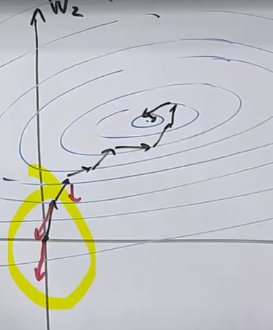

# Machine Larning 1 - Linear Classifiers


Sign means you gotta commit, which side are you on?

Visual intuition:


Decision boundary
# Loss Minimization


The leaner take some data and retruns a predictor

From what we wanna compute to how we wanna compute

### Loss Function
Loss(x,y,w)


Score and Margin 

When margin is less than 0, it means the prediction is confidently wrong
(The score and actual Y has different signs)


The Loss function means: did u make mistake or not
[f(w) = y] : this returns 0 or 1 depends on the statement is true or false


## Linear Regression
### Residual
Try to catch how much did I wrong

Redidual is the distance between the true value y and the predicted value y

### Squared Loss

Squared Residual


Which one to choose?
The squared loss is kinda like "mean", where its value may got affected by outliers extremely

For standerded deviation, you can think that as medium, which less affected by outliers

## Minimize Loss => Train Loss


The sum of all loss averanged by the number of training data

This is a function of w(weight) because we wanna find a weight vector that best fit for all the data(points)

# Stochastic gradient descent

## Optimization Algorithm
Terrin map(等高线)

### Gredinent
Where the value is increase the most


The gradient decent is great, but for morden examples with millions of examples, this can be really slow

It's slow because We have go through all the points for each iterations

The idea for `Stochastic gradient descent` is that, maybe we don't have to do it



This grediant is from all the examples from all points in your trainning set.


It is a sum of different things pointing to different directions, which all averange out to this direction.

So maybe we can not agarange all of them, maybe just a couple of them, or even just pick one of them

The key idea is **It not about quality, it's about quantity**


## Step size
Choose wisely, either too big or too small won't be good

## Gradient descent for zero-one classification 
It won't work because the gradient is 0 lol

We can try to make it non-0 though


## Summary


- To train, you have to access how well you are doing: 
    - You can use margin or residual for classification or Regression respectively
- You can define loss functions
- Optimizing with SGD(which turns out to be a lot faster than GD)

```python
import numpy as np

###############################################################
# Modeling: what we wanna compute
# points = [(np.array([2]),4), (np.array([4]),2)]
# d = 1

# Generate artificial data
# Let's first decide what the right answer is
true_w = np.array([1, 2, 3, 4, 5])
d = len(true_w)
points = []
for i in range(10000):
    x = np.random.randn(d)
    # Add some noise lol
    y = true_w.dot(x) + np.random.randn()
    points.append((x, y))

def F(w):
    return sum((w.dot(x) - y)**2 for x, y in points) / len(points)

def dF(w):
    #外层求导 后内层求导
    return sum(2*(w.dot(x) - y)*x for x, y in points) / len(points)

def stochasticF(w, i):
    x, y = points[i]
    return (w.dot(x) - y)**2

def stochasticDF(w, i):
    x, y = points[i]
    return 2*(w.dot(x) - y)*x
###############################################################
# Algorithm: How we compute it

# the gradient descent depends on a function, the gradient, and dementionality
def gradientDescent(F, dF, dementionality):
    
    w = np.zeros(dementionality)

    stepSize = 0.01
    for t in range(100000):
        errorSum = F(w)
        gradient = dF(w)
        #Gradient tells me where the function is increasing so we move to the oppisite direction
        w = w - gradient * stepSize
        
        print("iteration {}: w = {}, ErrorSum F(w) = {}".format(t, w, errorSum))

def stochasticGradientDescent(sF, sDF, dementionality, n):
    
    w = np.zeros(dementionality)

    stepSize = 0.01
    for t in range(1000):
        for i in range(n):
            errorSum = sF(w, i)
            gradient = sDF(w, i)
            #Gradient tells me where the function is increasing so we move to the oppisite direction
            w = w - gradient * stepSize
            # Somehow this is not work lol
            # stepSize = 1.0/(t+1)
        
        print("iteration {}: w = {}, ErrorSum F(w) = {}".format(t, w, errorSum))

# gradientDescent(F, dF, d)
stochasticGradientDescent(stochasticF, stochasticDF, d, 10)


```