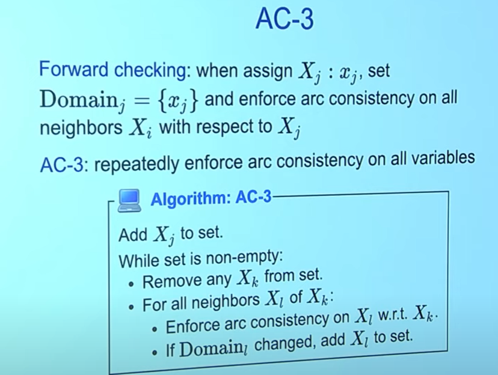

# Constraint Satisfaction Problems

Overview

## State based model review

For the example we had,  there are some constraints and you don't have to worry about the order(it doesn't matter)

## The Color State Example

The order here doesn't matter

We can definitily consider this problem as a search problem, with different states
And we give it an initial state
Let's say somehow we start with WA, V, T as red, and try to search for solutions for the whole problem

So state based model seems too complicated for this, we can try to make things easier

A higher level of abstraction

# Factor graphs

So I have three people, each of them are gonna choose a color either red or blue, and we have a bunch of constraints

Factor graphs are gonna have some number of variables

Factor of X1 is a function of X1, tells me how happy I would be if X1 takes value red or blue
## Model the problem
Factor graphs
- Variables: X1, X2, X3
  - For each variable, it's gonna belong to some domin {R, B}
  - Assignment: Assign values to variables
- Factors: reflacts the constraints that we need to satisfy
  - Scope of factor: set of variables a factor depend on
  - Arity of a factor: number of variables in the scope

`[X1 = X2]`: An indicator function returns 1 if the statement is true, and 0 otherwise
In the factor graph, 0 means I absolutly do not wanna choose this
For `prefer`, you can add some values after the indicator function

Q: does the factor value matter?
A: Yes, but in this class we will not foucus on this

## Formal Definition

So more formally, A factor graph is
- A set of variables `X1` to `Xn`, and each of these variables lies on some domain (in this case `R` or `B`)
- And factors from `f1` to `fm`, which are functions over X that is going to be >= 0
It tells us what are the things that we really want

So the factors here are just telling don't give same color to two neighbours

## Assignment weights
So factor tells us how happe we are for the single assinment
The weight tells us how good the whole assignment is

the weight can just be the product of all the factors

Objective: Find the x that maximize the weight

In this example, the indicator function is just 0 and 1
If we find the solution then the weight is gonna be 1
If not then it's gonna be 0

## Constarint satisfaction problems

CSP is just factor graph where all factor function value is either 0 or 1
When we find an assignment where weight = 1, this means we find an assignment which satisfies all the constraints
`iff`: If and only if

# Dynamic ordering
Let go and talk about how we gonna solve this
How to find an assignment to achieve consistency

What we might solve this in a human way:
We pick some initial value and go with some order, try to find assignments satisfy the constraints

## Dependent Factors

D(x, xi)
`x` is the assignment
`xi` is the new variable I am picking
And it's gonna return a set of factors that depends on `x` and `xi`

The Dependent Factor allow us to think about the next thing we should be worried about

## Backtracking Search

Backtrack(x, w, domains)
x: Partial assignment we have
w: Weight we have so far
domains: domain of the variables that I have so far

- If `X` is complete then we are happy
  - If X is already a complete assignment, then we'll update the best thing we have and return (base case)
- Choose unassigned variable `Xi`
  - Figure put what is the next variable I am gonna pick
- Order values in Domain i of chosen `Xi`
  - We gonna pick some value for the variable, from the domain
  - Maybe the only two color availible for variable `Xi` is R and B, and we gonna order R and B with some heuristic
- And for each value in this order we decided, we gonna update the weight `w`
  - `delta - add on weighe` is gonna be the product of all factors of
    - partial assignments whatever you have decided so far (`X`)
    - Union whatever value ur looking at for this new variable `Xi` to pick (color for example)
  - `Fj` are the dependent factors of (partial assignment, new variable), meaning we are lookint current partial assignment and xi
  - If `delta` == 0, continue, meaning this assignment does not work(it made everything 0), and we should try other things
  - If `delta` != 0, meaning his assignment works and we can update our domain, that's the thing that can save us time
- Backtrack()
  - X: we extended it by value v
  - w: whatever weight we started * delta
  - domain: updated domain

### Update domain - forward checking approach

One example is: let's say we decided WA to be red, we can just look at its neibours and see if we can update domain for them(and we found they cannot use red)

### Heuristic
#### Choose which unassigned variable `Xi`

**Pick the most constraint variable**
Why?
- Less options
- If it is gonna fail, let fail early
#### What Value to choose
**Pick the least contraint value**
to leave options for other variables around you

We are gonna pick the one that leaves the most options possible
So we gonna order the value of selected variable `Xi` by decreasing number of consistent values of neighboring variables

This will only work if we are doing forward checking

# Arc Consistency
For forward checking, we are just checking neighbor node and update domain
For Arc Consistency, it goes through the whole CSP and tries to update the furthur nodes ahead of us
The main idea is to reduce the branching factors

Basically it ensures everything should be consistant between Xi and Xj
If it is inconsistent, remove it, and tries to make all factors are not euqal to 0

The only thing we are touching is Xi, to make it consistent with some other Xj 

If the domain is changed, add the node back in
Time complexity worst case scenorial O(ed^3)

# Modeling

Event and Timeslot should both belong some given set A

E as variable (we get constraint 1 for free)
E number of variables of domain of size T
E^2 binary factors (constraint 2) + E number of unary factors (constraint 3)

In this formulation:
constraint 1: Each timeslot have an event or nothing
constraint 2: each event have one unique t => all t have no duplicated e (think about sculpture example). This gonna be a t-ary factor
  - So I have less factors but it is t-ary

Which one to choose?
It really depends on the number of t or e, which one is greater.

If we have less event but more timeslots, formulation 1 is better (e^2 binary constraints). 
If we have less timeslot but more events, then formulation 2 is better ()

If we have n-ary constraint, we can transform it into binary constarint that are equivelent. The reason is usually our algothrim requires to have binary or unary constraints

The idea is to define a new variable
