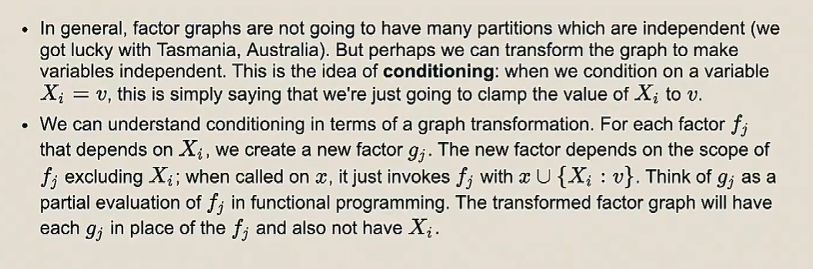
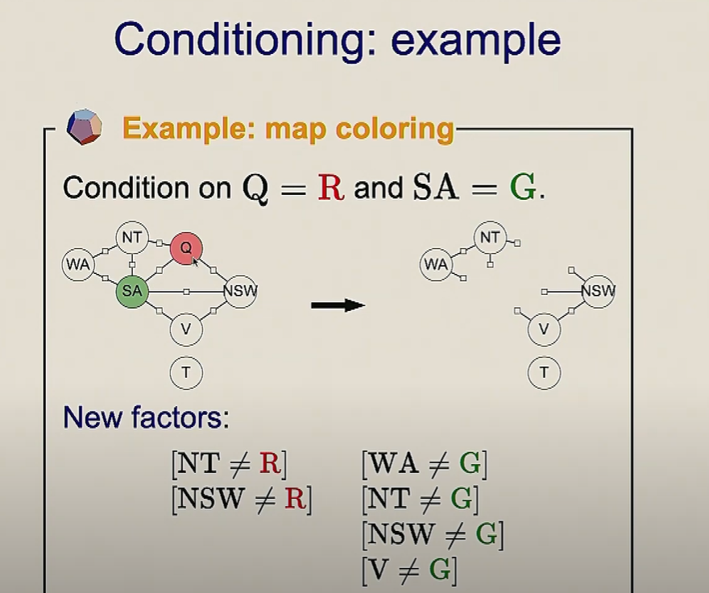
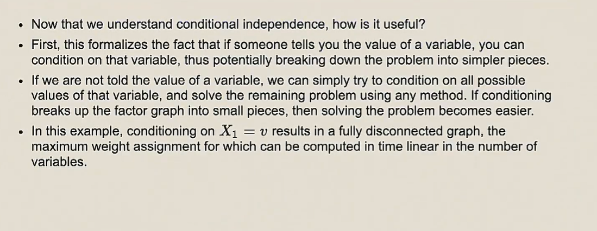

## Factor Graphs 2 - Conditional Independence

Gonna be really slow, exponential time

We have these things but they can only work for constraints
only when a factor that gives us a zero, then we know we can prune that branch
So if we have a factor that is non-zero, we can't use any of these...

So, backtracking is slow, but it gives u the optimal solution all the time

We have sensors that gives us noisy estimates for where is the thing every point at a time.
But the sensor is noisy, we cannot fully trust it, so we need to assign true locations 

Observation Factor: How close is our guess to the observation(what sensor said)

So now we run the backtrack algorithm, and it returns solution, where X1, X2, X3 are at position 1, 2, 2

# Beam Search

## Gready search

Backtrack gets us the best solution, but it is very slow, let's try to speed it up

One way to speed it up is Greedy search, where we only look at the branch that gives us higher weight  at this local window.

Pros: Very fast, linear
Cons: Very narrow window, you don't see a lot of state space, you don't explore so u will often miss the global max

So this basically says we loop and take the highest weight variable only

## Beam Search
Beam Search is kind of like in between of backtracking and greedy

Instead of maintianing only 1 partial like greedy, we maintian a list of K partial assignments
- We have k partial assignments
- Extend them with **all** possible succssors
- Sort them by their weight and Take only top K partial assignments
- And move on

Time complexity:
`b`: branching factor - domain, you need to try out every possible solutions
`K`: we are maintaining partial assignments of size K, for each K we try all values in domain. so it's K*b
`(K*b)log(K*b)`: we always need to sort all possible assignments and take top K, the sort takes NlogN
`n`: the depth of the tree - we have n variables

# Local search

We already have a complete assignment, and we are trying to make changes to it and improve it (improve the overral weight)

In this case we already have the assignment (0,0,1), and improve based on X2
so we try out all the values it can take on, which is 0, 1, 2
Then we recompute the weight and pick whatever value is the best.
In this example we found (0,1,1) is the best

One cool thing about ICM:
When evaluating a new value for that variable,
we only need to consider factors that touch that variable. 
Cuz everything else is consistant with respect to it, and it saves a lot of time.

Iterated conditional modes:
You can solve the whole CSP by this way
But it does not guarentee an optimal solution, it converges to local optimum

In this example it converges to 4, however backtrack gives us the optimum is 8

# Gibbs sampling
One way around this is a second algorithm called `Gibbs sampling`
With Gibbs sampling we are injecting some radomness into the process and try to bump us out of those local optima, into sth that can maybe get up a better area.

 
Gibbs sampling is super similar to ICM, we still try out all the values
The only difference is that, instead of selecting the value that gives u the heighest weight,
we sample the value, according with probability that's proportional to its weight
1/5 -> 0.2
2/5 -> 0.4
2/5 -> 0.4

## Example

We keep tracking a count of how many times we have this assignment
Overtime, we will find some high weights with some assignment is gonna occur very often

Thus the global optima is (usually) the most frequent, which is really cool

## What can go wrong?

If we have a problem, two ppl, going to restaurant(vege or steak house).
Constraints:
They wanna go to the same restaurant
They both really wanna eat vege.
They eat steaks but they are not super crazy about it

If somehow they follow the probability and choose (S,S)= 50
There's no way they can find the actual global optima is (V,V) = 100
Because changing one variable assignment resulting in (S, V) or (V, S), and it's much worse
It's really hard to bounce between (S,S) and (V,V)
In order to make it to (V,V) from (S,S), one has to make the decision to go to different restaurant, which  has a really low value

So a single Gibbs sampling is not guaranteed to find the global optima

Answer: Only backtracking
Greedy is too narrow
Beam search is `maybe` too narrow
ICM is too myopic (short-sighted)
Gibbs sampling is trying to find, it's likely but not a guarantee

# Conditioning

A and B are independent if there no factor/edges/paths that connects them

That's when we need to introduce this idea of conditioning
conditioning is a way to rip nodes out of a graph

Q: Will all CSP problems can be represented as graph problems?
A: Yes, variables are nodes and factors/constraints are edges

 

So what if let's say X2 is definitely blue?
We reduced the binary factor into a unary fator(Since X2 doesn't matter now)
The price to pay is that (at the condition of X2 is being blue)

## Conditional independent

 
We say A and B are conditionally independent, because once we condition on C(once we pick a value for C), 
A - C and B - C turns into stumps, and now there's no edges or path that connecting them or reach each other.

 

## Markov blanket
Pick one or more variables
What are the variables that I have to destory to make my variable an island(independent)

Examples:

Pick: V
Markov blanket: SA NSW

The set of node you have to conditional on, is called the markov blanket of the set of nodes you want to be independent
The set notion:

## Example
So now we can use this idea to create independent structure now
So we can just repeatedly condition the value and solve

So this becomes very quick and you can read the maximum weight very easily

> This covers all the possible combinations that backtracking could have
> But this is much faster, cuz we are taking a very complicated problem and break down into easily solvable pieces

In this example we are traking an exponential problem and break it into a linear number of linear solvable problems

# Elimination

We dynamically choose the best value for x2

So now for any value of x1, the value of x2 is set, it's fixed

We can run elimination on the whole graph and the last variable will hold the best answer

You go forward and eliminate, then you go backward and read the choices

In general, the treewidth, it quite hard to compute 

 