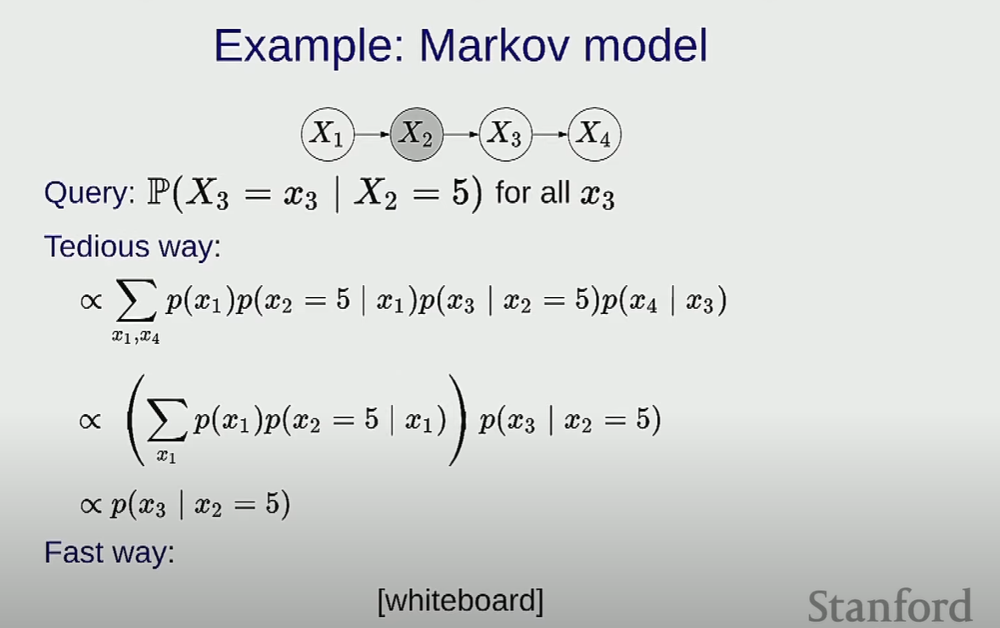
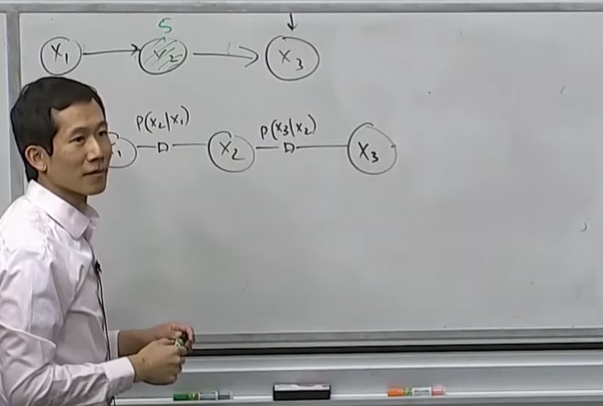

# Bayesian Networks 1 - Inference

Specify locally (Factors) and optimize globally (Weight)
Last time we talked about different algo for finding the maximum weight 

The framework is already good, with this you can come up with a lot
But what are these factors mean and how do we come up with them?
philosophically we might be quite bothered by this

So the goal of this lecture is to give more meaning to the factors, and bayesian network is the way to do that.
In a line, bayasian networks are factor graphs plus probability

Previously we already talked about a lot of modeling: search games, MDPs
And then we talked about modeling when the order of actions does not matter so much, and it is more nature to think it as variables and assignment
And now we will move on to bayasian networks where it will be a higher level of abstraction

# Basics

Notations;
Captital letters (S, R): random variables
samller letters (s,r): values that random variables can take
Notation P with Captital letters P(S, R): the whole probility destributions, eg P(S, R) is the destribution table
Notation P with =s, =r assignments P(S=s,, R=r): represents a signle number, which is a probility, eg: P(S=1, R=0) = 0.7

Marginal distribution:
eg I don't care about r, just wanna focus on s > 
Sum up probs when s = 0, s = 1 and u get the table

Conditional:
Select rows based on condition, normalize them and let them sum to 1.
normalize (a,b) means a' = a/(a+b), b' = b/(a+b)

Think of joint distibution as a database

**Probabilistic inference**:
You observe some evidence, that's what we know
and what we like to find out is weather it's raining

Is that reaning under condition of we know it is autumn and traffic 

Challenges:
the joint distibution table can he really huge
Cool thing about bayasian networks is that it allows us to define joint distibution using the language of factor graphs

A: prob if alarm going off
 
2. Define local conditional distribution

a local conditional distribution is:
P of whatever that variable is, given its parents, parents are the variable directly point into it
In this example the parents of `a` is `b` and `e`

1. define joint distribution 
   

The small `p` stands for local conditional distribution, it's the thing we need to define (it is the ground truth cuz we defined it)
The capital `P` stands for joint distribution 

Okay this is bayasian networks, and what's the connection between this and factor graphs
This looks like `weight = product of factors`

In this special case:
one factor per variable
has a single factor connect all parents

So given the alarms goes off and there's a bulargruy, decrease the prob of earthqeak

We might doubt that, `E` and `B` are independent. That's true but when we are conditioning on `A`, we already changed the independent structure of the model, which means when alarm goes off, `E` and `B` are no longer independent

## Definition

Xparents(i) means the value assigned to parents of i

if we summarize all possible values Xi can take on, it should be 1, and it is true for every settings of Xparents

def means by the laws of probabiliy
So by the laws of probabiliy we can take p(b)p(e) out side

We've made an algerbric operation graphcially

You marginalize a leaf node in Bayesian network, you can just drop it from the graph

### Consistency of local conditionals

They are equal

 
Let's define it with procedure

h: coughing

# Probabilistic programs

Bernoulli: returns true with prob epsilon

define a distribution?

this program reduces to a particular bayesian network structure, where each Xi is only connected to Xi-1

For every position, generate a word given previous word

Convention:
If shade a variable, means u observe it
If not shade a variable, means u can't/don't observe it

We have two object and two independent markov chains running
At each time step, I only observe one sensor reading, and that sensor reading is gonna be some combination of the actual objects a and b

It's like another way around, we start with output
We first define the model

A set of variables H, which u don't observe, that generates/causes a set of variables E, which you do observe

# Inference

 
1. We wanna remove as much as variables as I can
   1. Marginlize non-ancestors, meaning that anything upstream i can keep for now, anything down stream I can let go
2. Convert to a factor graph
   1. Remove the directions(cuz it's complex and easily to get confused), make things easy
3. Condition on evidence, we are conditioning on X2, so we wrap it put and change the factors to be a partial evaluation
4. Marginlize out the disconnected components (We care about X3 only, since they are disconnected, we can drop it since it's not related)
5. Do work, you might not just left with one node, in this step we need to solve the factor graph

