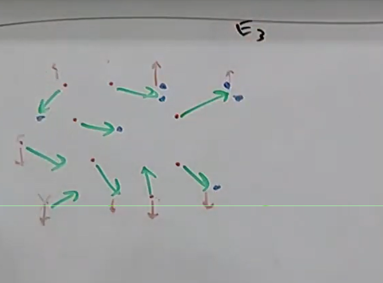
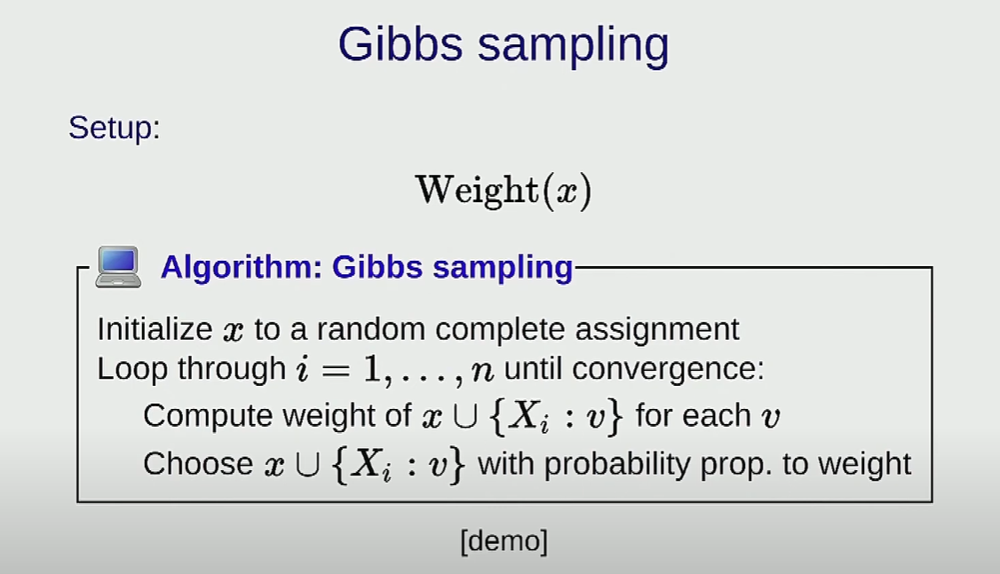

# Bayesian Networks 2 - Forward-Backward

**What is a Bayesian Network?**
We have a set of varibales, which are the nodes in the graph
These nodes are connected by sets of directed edges, which captures various dependencies between them, eg:
I is caused by A but not C

Formally, for each vairbale in Bayesian network, it has a local conditional distribution, which specifies the distribution over that variable given its parents
eg: parents of `cough` are `cold` and `allergic`, so we have a local condition P of H give c and a, denoted by `P(h | c,a)`

We do it for all the variables, and finally we take all the factors or local conditional distributions and multiply them together and we get one glorious distribition over all possible variables. 

**Probabilistic inference**

Given a Bayesian network(like a probabilistic DB), and we look at some evidence we've found, and query the Bayesian network(probabilistic DB) with set of variables we are interested about (Q), conditioning on the evidence(E). So the goal is to compute the prob of query variablies(Q) conditioning on the evidence(E) that we see.

Bayesian network is like a powerful way to describe/store knowledge(like DB) as a probabilistic format
It's like a knowledge source which can be probabilistic, which captured by joint distribution. once you have it, you use the tool of probabilistic to answer arbitary questions, you can query anything based on the evidence you saw

The challenge is how to do this efficiently(Which is the topic of this section)
How to compute these arbitrary queries efficiently
# Forward-Backward

## Hidden Markov model
A Bayesian networks where exists a sequence of hidden variables corresponding sequence of observed variables(gray ones)

The distribution over these variables are specified by three types of local conditioning distributions:

Transition: captures how dynamic this object/car can move over time.
Emission: How sensor reading is computed as a function of location (how to read sensor -> location, sensor may have noise)
The joint distribution is just the product of all three of them (Cool)

Filtering:
Ur at a particular timestep(eg 3), what do I know about the location(H3) given all the evidence I've seen up until now? - real-time object tracking
Smoothing:
Given all evidence at all timestep, what **was** object at timestep 3

So if we solve `Smoothing` then we solve `Filtering` as well, why?
Because we can marginlize E4 and E5 to get `Filtering` :)

So we will focus on Smoothing

## Lattice Representation
Why we need?
To many combination for all variables, we need a way to compute it efficiently, we need a compact way to represent those assignments

Totoally K*n nodes:
n: number of time steps
K: number of values of Hi

A path from start to end represents a particular assignments to hidden variables H

E1, E2, E3 are the observed values(evidence)

Let's put prob to the path
When we multiply all prob along the path, it is exactly the weight expression for:
H1 = 1, H2 = 1, H3 = 1, given E1 = 1, E2 = 2, E3 = 1

Suppost we wanna know prob of (H2 = 2 | E1 = 1, E2 = 2, E3 = 1):
Sum up all the **weights** of paths goes through H2, divide by sum of all path

We don't wanna sum up all paths literally, cuz that's gonna be exponential time
We can do it recursively with with **dynamic programming**

For every node I'm gonna compute 2 numbers:
Forward (Green)
F
Backward (Yellow)
B

every edge has a weight associated with it(Should be fractions but we use decimal here for simplification)

And now for each node, just multiply forward and backward together
We are multiplying cuz it's like: (All paths coming in) * (All paths going out), which covers all the combinations, and the weight of the path should also be a product

Final answer: 9/24

Why are these called messages?
It's like msgs sent across the graph lol

Forward messages for every node:
>The sum over all (values of previous time steps forward message) * (the weight on the edge from previous node hi-1 to current node hi)

Backward message for every node:
>The sum over all (values of next time steps backward message) * (the weight on the edge from next node hi+1 to current node hi)

S: The product of F and B

If u normalize it, it's gonna give u the all the smoothing query values u want

This algo is pretty old, designed for speech recognizition

Time complexity:
O(nK^2)
n: n time steps
K^2: k possible values, for each time step, u have K possible values/nodes, and for each node u need to look for K previous node, that's K*K = K^2

It take the same time to compute the single query

Q: Does Lattice representation works for other Bayesian networks
A: It works for some other types, but for Bayesian networks with cycles, it won't work

# Particle filtering

We are still interested in HMM
and we will focus on filtering question only

IF the K is too large, eg a 2D grid, and each points is a possible possible position(10K * 10K)

But for filtering we actually don't need to consider all possible combinaitons, we should be able to focus on some area

The beam search gives us some inspiration

A little better than the forward-backward:
for forward-backward we have (domain-sized) * (domain-sized)
for beam search (size of the beam) * (domain-size)
which is better, but still slow.
At the same time, greedily taking the best K might not be the best thing to do

So the idea of Particle filtering is just to tweak the beam search a little bit

I'm gonna maintain a set of Particles that kind of represent where I think the object is
and iteratively go through these three steps(propose, weight, re-sample)

**Propose**
At any point, Particle filtering maintians a set of partial assignments, called particals, that tries to mimic a particular distribution

We propose possible value of H3 based on H2
We get the sample of H3 form the transition disteibution P(h3 | h2)

simulating where cars are going

**Weight**
For each of those particals, we gonna assign a weigth now, which is euqal to the Emission of P(e3 | h3), so the particals closer to the observation are gonna get higher weight, and particals far away to the observation are gonna get lower weight

**Resample**

Top K is too biased

Blue: some sampled twice, some once, some are not(dropped)
# Gibbs sampling

In last lecture, Gibbs sampling is a way to compute the maximum weight assignment in arbitary factor graph, and it's main purpose is to get out of local minimum

We have a complete assignment and try to improves it
And we only need to consider the markov blanket for that variable

From prob point of view:

Distribution of assignments: Summing all the weights of complete assignments, normalize it, then u have a distribution

Gibbs sampling;
Loop through all the variables, for each variable check the prob of that variable on condition of everything else

The guarantee (under some conditions)is that if run this long enough, the sample u get is actually the true sample of the whole distribution(You've build the model, you've build the distribution), so u can compute any marginal distribution

We assign 2 to neighboring equal and 1 to neighboring inequal

