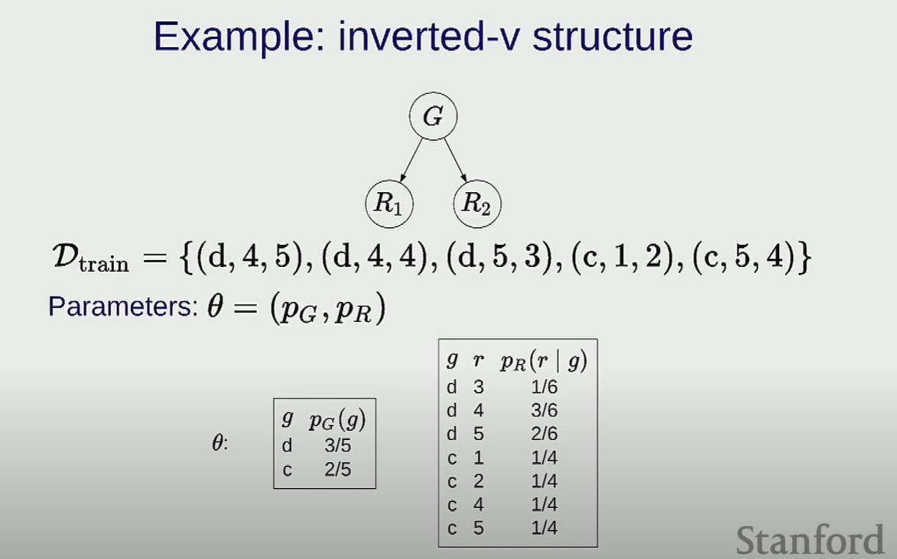

# 15. Bayesian Network 3 - Maximum Likelihood

We are gonna talk about learning

So far we have just assumed that someone  hands you these local conditional distribution which has numbers filled out
In real world we have to figure them out from data

# Supervised learning

It turns out that probabilistic inference is more expensive
So in fully supervised learning it should be easier

Fully observed

count and divide, then normalize
> proportional to relationship in mathematics. It is denoted by the symbol ∝, A proportional relationship is where one ratio is the same as another ratio

We first access Pg and Pr separetely

Be careful when u normalize P(r | g, a)

When normalize, we focus on r only
For every possible unique setting (g, a), I have a different distribution
Cuz the question is: what is the value of r, if `G=g` and `A=a`, so we gonna normalize based on (g,a) pair
So (d, 0) is a distribution over 1 or 3

For R1 and R2, we are normalize based on g

We now want a pR to generally represent all generally rating, cuz we don't want a single distribution for each rating
So we can combine R1 and R2

We are merging previous table R1 and R2 together
Note that we are assuming 
- all data in dataset are independent
- condition on g, R1 and R2 are independent

Each node is gonna be powered by some table,
So R1 and R2 now both powered by their joint table

We have 2 local conditional distribution here, even they have L+1 variables in total

2D + 2

We have Three tables:
- start 
- Transition
  - h' binds to current node and h binds to previous node 
- Emmision

Learning is going from data to parameters
- Data is full assignments to all random variables
- parameters are all the local conditional distribution (Three tables mentioned above)

Key intuition:
Count and Normalize

variable sharing:
All we to defind huge bayesian networks without having blow up number of parameters, cuz we can share parameters between different variables

D: set of types of distributions
Pdi: which of these distributions that belong to D is powering that variable Xi

For each example, for each variable, increment count for each (parents, Xi) pair
Normalize based on each parent assignment pair

## Maximum likelihood - Why does count and normalize make sense

If I see some data and I have a model over that data, I want to teak the parameters to make the prob of that data as high as possible.

in symbols, some prob is assigned to that training example(assignment of variables), and I want to find parameters theta, to make that number as high as possible

IF we are focusing on Pr(.|C) for example, then the other prob doesn't matter, so we can count individually and normalize

# Laplace smoothing

However, if we had just one data point, maximum likelihood places probability  on heads, which is a horrible idea. It's a very close-minded thing to do: just because we didn't see something doesn't mean it can't exist!

This is an example of overfitting. If we had millions of parameters and only thousands of data points (which is not enough data), maximum likelihood would surely put 0 in many of the parameters.

There is a very simple fix to this called Laplace smoothing: just add  to the count for each possible value, regardless of whether it was observed or not.
Here, both heads and tails get an extra count of 1.

For denominator we add total number of values it can take, for this case: (head. tails) which is 2.

As a concrete example, let's revisit the two-variable model from before.

lamda is a parameter for laplace smoothing, by default is 1. When start with a table, instead of filling with 0, fill with `lamda`

For example, d occurs 2 times, but ends up at 3 due to adding `lamda = 1`. In particular, many values which were never observed in the data have positive probability as desired.

- More generally, we can add a number  (sometimes called a pseudocount) to the count for each distribution  and local assignment .
- By varying , we can control how much we are smoothing.
- No matter what the value of  is, as we get more and more data, the effect of  will diminish. This is desirable, since if we have a lot of data, we should be able to trust our data more.
  
# Unsupervised learning with EM