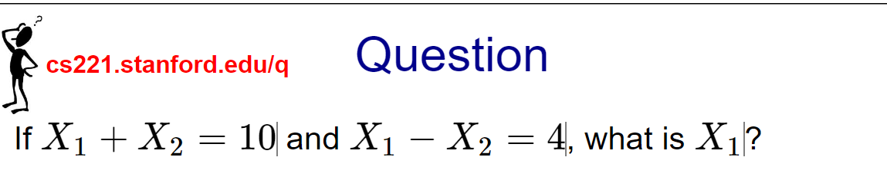
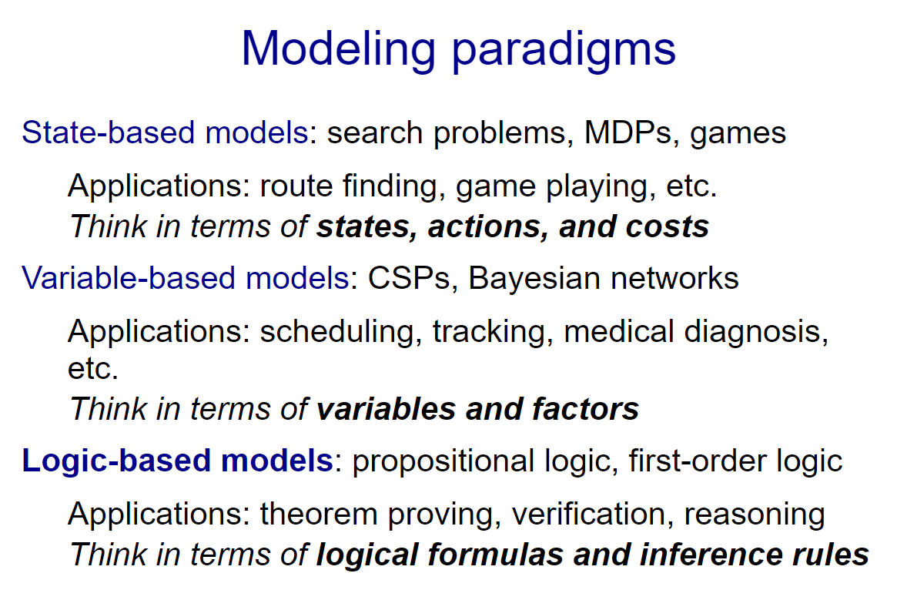

# Logic 1 - Propositional Logic

Think about how you solved this problem. You could treat it as a CSP with variables X1 and X2, and search through the set of candidate solutions, checking the constraints. (Two constrains `X1+X2=10` and `X1−X2=4`)

However, more likely, you just added the two equations, divided both sides by 2 to easily find out that `X1=7`. This is the power of logical inference, where we apply a set of truth-preserving rules to arrive at the answer. This is in contrast to what is called model checking (for reasons that will become clear), which tries to directly find assignments.

We'll see that logical inference allows you to perform very powerful manipulations in a very compact way. This allows us to vastly increase the representational power of our models.

For each topic (e.g., MDPs) that we've studied, we followed the modeling-inference-learning paradigm: We take some data, feed it into a learning algorithm to produce a model with tuned parameters. Then we take this model and use it to perform inference (turning questions into answers).

For search problems, the question is "what is the minimum cost path?" Inference algorithms such as DFS, UCS or A* produced the minimum cost path. Learning algorithms such as the structured Perceptron filled in the action costs based on data (minimum cost paths).

For MDPs and games, the question is "what is the maximum value policy?" Inference algorithms such as value iteration or minimax produced this. Learning algorithms such as Q-learning or TD learning allow you to work when we don't know the transitions and rewards.

For CSPs, the question is "what is the maximum weight assignment?" Inference algorithms such as backtracking search, beam search, or variable elimination find such an assignment. We did not discuss learning algorithms here, but something similar to the structured Perceptron works.

For Bayesian networks, the question is "what is the probability of a query given evidence?" Inference algorithms such as Gibbs sampling and particle filtering compute these probabilistic inference queries. Learning: if we don't know the local conditional distributions, we can learn them using maximum likelihood.
We can think of learning as induction, where we need to generalize, and inference as deduction, where it's about computing the best predicted answer under the model.

Each topic corresponded to a modeling paradigm. The way the modeling paradigm is set up influences the way we approach a problem.

In state-based models, we thought about inference as finding minimum cost paths in a graph. This leads us to think in terms of states, actions, and costs.

In variable-based models, we thought about inference as finding maximum weight assignments or computing conditional probabilities. There we thought about variables and factors.

Now, we will talk about logic-based models, where inference is applying a set of rules. For these models, we will think in terms of logical formulas and inference rules.

Historically, in AI, logic was the dominant paradigm before the 1990s, but this tradition fell out of favor with the rise of probability and machine learning.

There were two reasons for this: First, logic as an inference mechanism was brittle and did not handle uncertainty, whereas probability offered a coherent framework for dealing with uncertainty.

Second, people built rule-based systems which were tedious and did not scale up, whereas machine learning automated much of the fine-tuning of a system by using data.

However, there is one strength of logic which has not quite yet been recouped by existing probability and machine learning methods, and that is the expressivity of the model.

