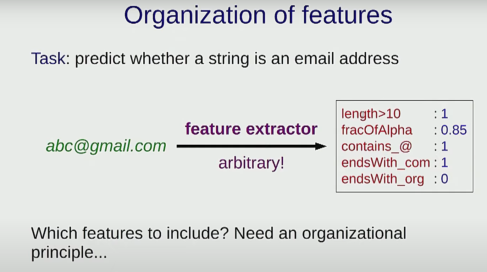
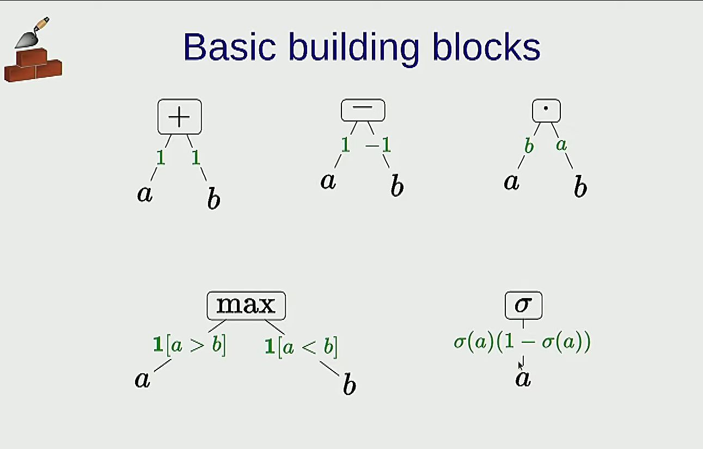

 # Machine Learning 2 - Features & Neural Networks
---
 ### A regression example
 

# Features

## Feature extraction

A feature extrator takes an input and output a set of properties which are useful for prediction

### Feature templates
 
 

 ### Feature templates
the phi - bottle neck
### Hypothesis class

All possiable predictors that we gonna get (With this set of features)

Think of set of functions you can get, by that set of features

#### Examples

### Full pipeline of Machine learning

- The hypothesis class is the set of all predictors
- When you go and define a feature map, that is gonna carve out a much smaller set in the hypothesis class
- What is learning doing is choosing a particular function of that family (two bigger sets), based on the data

This means:
- You first define a set of functions that u interested in
- And now you say, okay based on data, let me go and search through that, and find the one is best for me 

### An example task

Feature tamplate:

The `time elapsed` is a single number, it can be really small or large, which means, if it is really large, the contribution to the score gonna be really large, it going to affect the model too much, which you might not want to see. (too sensitive)

In this case, you can split it into pieces/intervals
eg `time elapsed between ... and ...`

# Neural Networks

The true function:
Check if the distance of two cars are larger than 1

Break down the problem

But in the real, we don't know what are these functions
Can we kind of learn those funcitons?

Well now lt's make it abstract:

h1 = -1 + x1 - x2 >= 0

=>

x1 - x2 >= 1 

That are the same, just another forms of representation

In the neural networks, we will leave `v1`, `v2`, `w` as unknown, and try to fit them through training

## How do we learn it
There is a problem, h1 with respect to v1*phi(x) is 0, and we don't like it, cuz SGD won't work

So we can find a function smooth it out with logistic fuction

## Define nural nets

The neural nets are breaking a problem into subproblems, have the result of intermidiate computations, and they become feature of next layer

It's linear classifiers packaged up
The outcome of one set of classifiers become features to the next layer, and so on

For deeper networks, as you proceeds, you can derive more abstract features

## Do the neural learning
How calculate the gradient

Computation graph

Think what if we change the input a little bit

The chain rule 

### Note on optimization for Neural nets

The convex functions are those you can hold in hands :)

However, the train loss for Neural nets turns out to be non-convex. Meaning using gradients to find optimum point can be hard, sometimes you endup in local optimum.

## Nearest Neighbours

离得越近 越有可能是一类

Can be computational expensive because u have store entire trainning set

