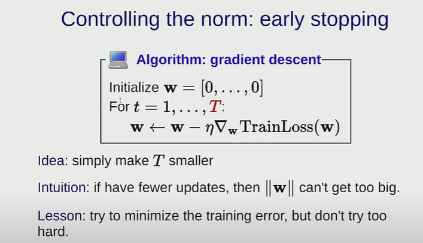

# Machine Learning 3 - Generalization, K-means
---
True goal for machine learning

Is to minimize error on unseen future examples

# Generalization

## Evealuation & Prevent overfitting

f*: The ture function/answer, the function that always get he right answer
g: The best prefictor you can get in your hypothesis calss (The fuctions u get can after feature engineering)

It is quite a trade-off

## How to control the size of Hypothesis class

### Norm

Let say we have a linear regression y = wx
The whole function space would be all linears lines that pass the origin

If somehow we can define, let's say the w is smaller or closer to 0, then we can eliminate many useless function, and thus reduce the norm

This means shrink the total number of weight vectors that you are considering, as u putting more constraints, they will be smaller

#### Regularization
Controlling the norm

You can add some `panelty` to your Traning loss function

This is saying: Optimizer, you should try to make trianing loss small, but also try to make the second part(weight vectors) small as well
 
So this is saying that, fit the data but not at the costs of having huge weight vectors(Which may be overfitting)

It is important that these need to be the same w and you are optimizing the sum

#### How to do it
Gradient descent

### Controlling the Norm - early stopping
Just stop early

Because normaly we initialize the weights from a baseline near 0,
For neural nets, we might give it a random value near 0

IF u have a pre-given weights, then basically ur saying don't go too far from ur initialization

We start the norm/weight vector from 0, and for each training, generally the norm gonna goes up.
So if you stop earlier, you won't give norm much chance to grow too big

### Hyperparameters
How to choose them?

## Normal Training Process

You can start with quite specific features and then generalize it

# Unsupervised learning
Fully labaled data is very expensive to obtain

## Clustering

z1 ... zk
Tells me which of these K clusters I'm in

### 

For each cluster, there's ginna be a centriod (质量重心)

The Objective function
For each point I meature the distance between that point and the centriod associated
And try to make this number as smaller as possible

A simple exapmle, you compare the distance to different centriods, and choose the closet one

Now it's like the chicken egg problem
IF i know the centriod, then I can do assignments
IF i know assignmemts, then I can easily figure out the centriod

But how to get those two?

### K-mean Algo

`K` is  a hyperparameter
How to u choose K?
You can try different K and choose based on loss

For a fixed itration of T

#### Step 1 Given Centriod and figure out the Cluster Assignments

Just check the distance 
you compare the distance to different centriods, and assign the point to the closet one

#### Step 2 Given Cluster assignments and try to find the centroid

Mathmatically you sum up all the points (feature vectors)
, and devided by the number of points => You get the centroid now!

#### Limitation

This is guaranteed to converged to a local minimum

K-means++ 
Initialize points far away from each other, generally works well

# Summary

