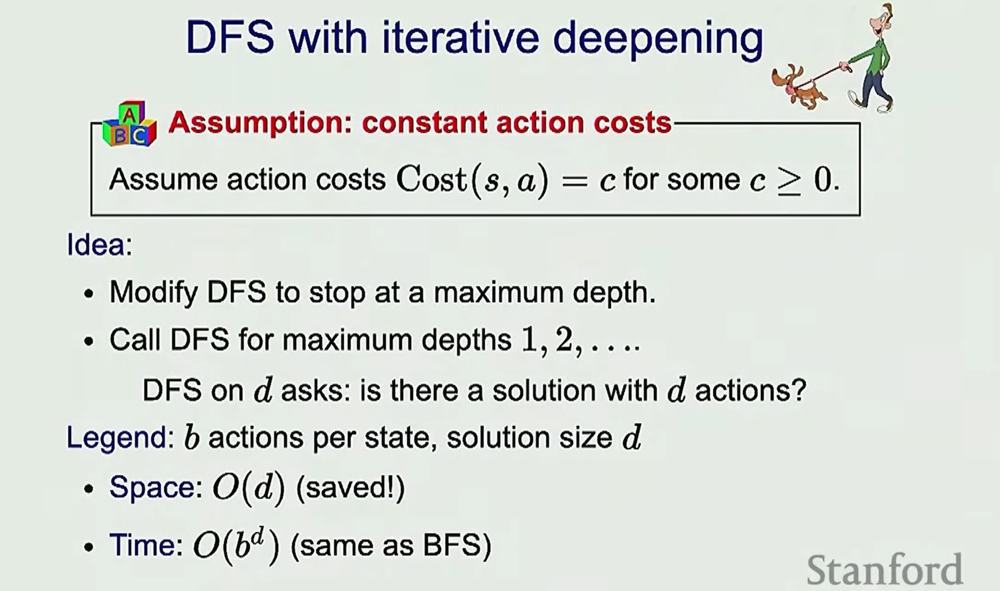
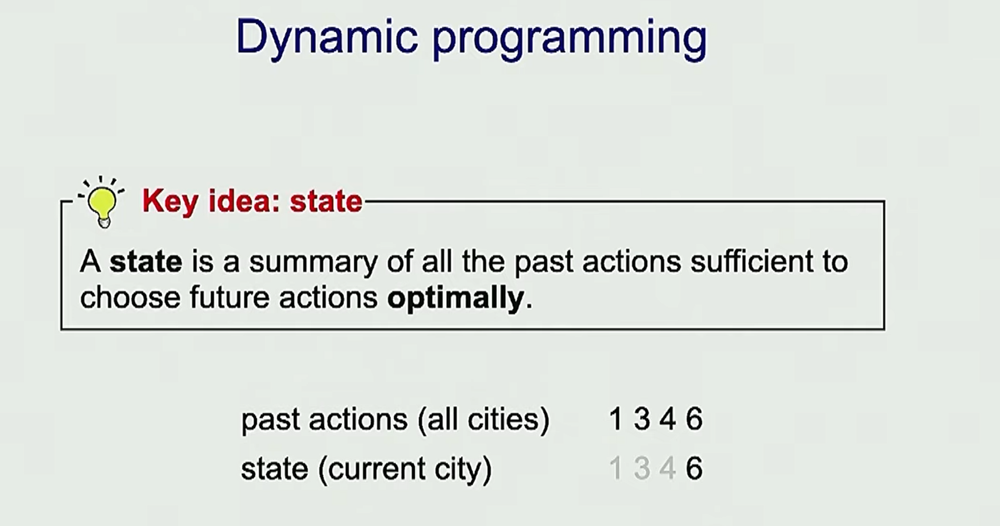

# 4. Search 1 - Dynamic Programming, Uniform Cost Search
---
State-based models and Search
## Intro

Open question
Dynamic Programming
Try all the possibilities


What are search problems?


## What's different from reflex-based models?

For state based models,You need to think about future
Cuz for each step, it's gonna change ur state

## Road map
We are going to talk about three different algo for doing inference, for searching problems

# Tree Search
Enumerate all the actions we can take


## Walk or tram


Defining the search problem model


| Algo | Cost | Time | Space | 
| -- | -- | --| -- |
| Backtracking Search | Any  | O(b^D) | O(D)  | 
| DFS | 0 | Worst case O(b^D)         | O(D)  |
| BFS | cost >= 0 (assuming all the cost are the same) | Worst Case O(b^D) |  Worst case O(b^D) ???  |
| DFS - ID | cost >= 0 (assuming all the cost are the same) | Worst case O(b^D)    | O(D)  |

### Backtracking Search

b : branching factor (How many branches it gonna hava from one node)
D : Depth of the tree


The time complexity is quite bad though lol

### DFS
When you don't care the cost of going back and forth


### BFS
This is useful when the costs are similar

### DFS - Itrative deepening
A combination of BFS and DFS


You can visit the same node multiple times, because u are runnning DFS each time u proceed

SO in the worst case, when u have to search through the whole tree,
the actual time complexity is O(b^d * b^d) => o((b^d)^2) => b^d*d
However, in time complexity O(), there's no big difference between b^d*d and b^d, cuz we care about the 数量级 only


The exponential time is not good, that's when dynamic programming comes to paly :)

# Dynamic Programming

Reduce the recomputation

State: a summary of all past actions


## Limitation
It does not run well with grapth with cycles


## Define the state

What if we have a rule saying u cannot go 3 odd cities in a row
We have to have a context of our past actions

State [prev city, cur city]
state space: n^2
The state space is too big, thus the program will be complax
=> 

State  [bool(if prev was odd), cur city]
state space: 2*n


For example
#means number
This can bring the complexity of state space from n^2 => 3n, which is linear


Bring the time O() from expential => polinomial


# Uniform Cost Search


Forntier: Explored by not sure about the optimal path to get there YET


In runtime, pop out the best one from forntier

What is the difference from A*??

# Code
```python
from enum import Enum
import sys
from queue import PriorityQueue

sys.setrecursionlimit(100000)

Destination = 10

### Model (Search Problem)
class TransportationProblem(object):

    WALK_COST = 1
    TRAM_COST = 2

    WALK = "walk"
    TRAM = "tram"

    def __init__(self, destination):
        # N number of blocks
        self.destination = destination

    def startState(self) -> int:
        return 1
    
    def isEnd(self, state):
        return state == self.destination
    
    def succAndCost(self, state : int):
        '''
        Return a list of (action, newState, cost) triples
        Meaning return the a list of: actions we can take, what new state we gonna endup at, and what the cost gonna be
        '''
        result = []
        if(state + 1 <= self.destination):
            result.append((self.WALK, state + 1, self.WALK_COST))
        
        if(state * 2 <= self.destination):
            result.append((self.TRAM, state * 2, self.TRAM_COST))

        return result


### Algorithms
def backtrackingSearch(self, problem):
        
    best = {
        "totalCost" : sys.maxsize,
        "history": None
    }

    memo = {}

    def recurse(currentState, history, totalCost):

        if(currentState in memo):
            for totalCost, history in memo[currentState]:
                best["totalCost"] = totalCost
                best["history"] = history
            return

        if(problem.isEnd(currentState)):
            #Update the best cost if we find a better solution
            if(totalCost < best["totalCost"]):
                best["totalCost"] = totalCost
                best["history"] = history
                memo[currentState] = (totalCost, history)

        for action, newState, cost in problem.succAndCost(currentState):
            recurse(newState, history + [(action, newState, cost)], totalCost + cost)

    recurse(problem.startState(), history=[], totalCost=0)

    return best

def printSolution(solution):
    totalCost = solution["totalCost"]
    history = solution["history"]
    print("minimum cost is {}".format(totalCost))

    for h in history:
        print(h)


# You just need to know the current state
def dynamicProgramming(problem):

    memo = {} # state -> futureCost(state) action, newState, cost
    def futureCost(state):

        if problem.isEnd(state):
            return 0
        
        if state in memo:
            return memo[state][0]
        
        minFutureCostWithAction = min(
            (curCost + futureCost(newState), action, newState, curCost)
            for action, newState, curCost in problem.succAndCost(state)
        ) 
            
        memo[state] = minFutureCostWithAction
        minFutureCost = minFutureCostWithAction[0]
        return minFutureCost

    
    state = problem.startState()
    minCost = futureCost(state)

    # Recover History
    history = []
    while not problem.isEnd(state):
        _, action, newState, cost= memo[state]
        history.append((action, newState, cost))
        state = newState

    return {
        "totalCost" : minCost,
        "history": history
    }


# searching method in a graph that visits nodes in order of their path cost from the start node. 
# It delves into the graph, visiting the node with the smallest cumulative path cost first.
def UniformCostSearch(problem):
    frontier = PriorityQueue()
    frontier.put((0, problem.startState()))
    
    while(True):
        # Move minumun cost from frontier to explored
        pastCost, state = frontier.get()

        # If the end state popped up, meaning we have already have the minumum cost to the end state
        # Everything else left in the queue would have a larger past cost.
        # If it's not (The end state may or may not in the queue yet), meaning there's other possible path
        # That may have a lower cost 
        if(problem.isEnd(state)):
            return {
                "totalCost" : pastCost,
                "history": []
            }
        
        # Add all the successors of current state to frontier
        for action, newState, cost in problem.succAndCost(state):
            frontier.put((pastCost + cost, newState))


### Inference
problem = TransportationProblem(destination=Destination)
# solution = problem.backtrackingSearch(problem)
solution = dynamicProgramming(problem)
printSolution(solution)

# solution = UniformCostSearch(problem)
# problem.printSolution(solution)
# print(problem.succAndCost(9))


```