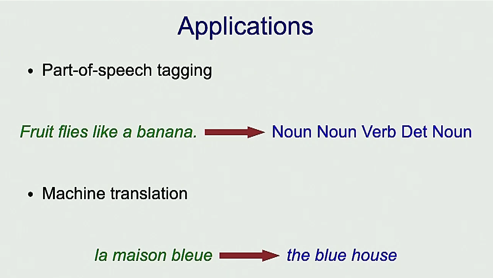
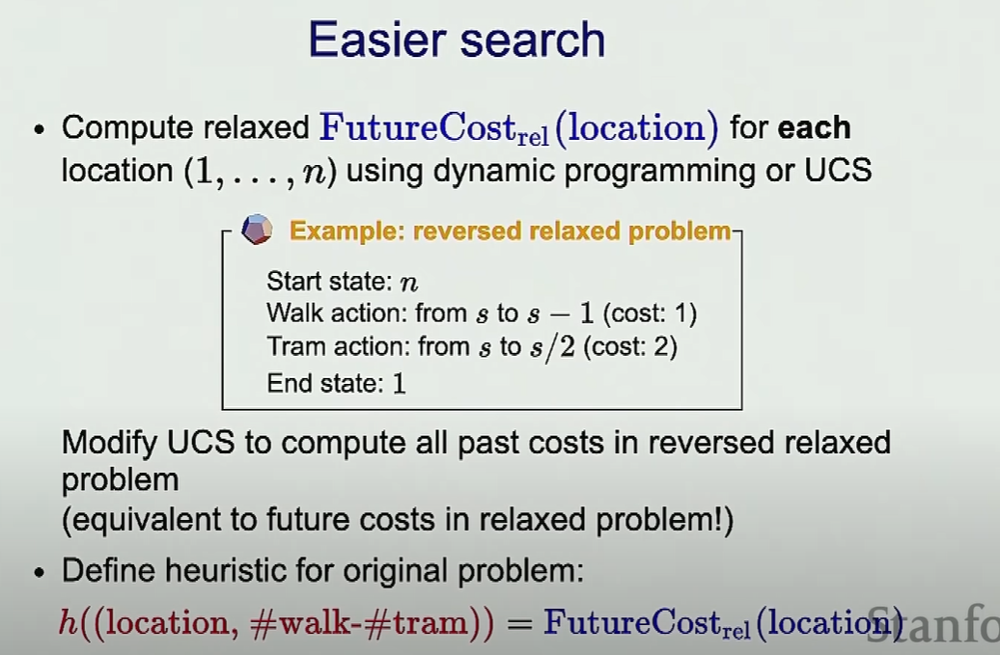

# 5. Search 2 - A Star Algorithm
---


# Uniform cost search
Uniform cost search is quite simlair with Dijkatra ?
Dijkstra is a special case of A* Search Algorithm, where h = 0 for all nodes.

Theory: Guerentee the shortest path:
It is guerenteed that when u pop up a point S from frontier
The cost/path is guerenteed to be the minimum cost/shortest path
 


Pu <= Pt + Cost(t,u)
This is the characteristic of preority queue


If u meet a graph with cycle and negative values, you can also use bellman ford algorithm (Beyond the scope of this class)

# Learning in Search problems
Back to our tram problem


However modeling is really hard, in many real world scenorial we don't know what the costs are

## Learning costs
If we know the optimal path already
So learning will predict what are the costs are, based on the optimal path

I wanna learn 
walk is 1
tram is 2

Another example

We wanna learn about ppl picking up the bottle
We really don't know about the cost function
However we can track the path that they took and learn the cost function from it.


Searching: find the path with given cost functions
Learning: Learn the cost function from given paths (inverse of search)


### How do we learn it 

Input X: The search problem without costs
Output Y: solution path

x => Predictor F => Y

#### A simplest example - Structured Perceptron


Let's say the weights only depends on the action (In real it can depend on state too)

We can randomly initialize the weights, and try prediction


>After predicted y', we'll check y and y'
we'll decrease the weight (meaning decrease the cost) (by 1 for example) for what's in real `y`, because we want the cost of true thing to be small
We'll increase the weight (meaning increase the cost) (by 1 for example) for what's in y'

We are doing this because we want to match the prediction 

>After predicted y', we'll see how different is it form y
If action are the same in y and y', the increased weight = decreased weight, the weight won't change(CUZ it's already the ture answer)
If we walk more in real y, the weight decreased will be more
Therefore, after such operation, we'll get closer to the true weight


w*a is the cost


In this example, in the second iteration, we converged to the "true" weights
We care about the **ratio** more

Will this converged into a local optima?


The cost function can be more complex

It can be a set of features 



# A* Algothrim

The uniform search is uniformly exploring all the state possible
The uniform cost search just explores in the order of the past cost

The idea of A* is basically do the uniform cost search, but do it smarter, to move towards the goal state


We don't really know about the feature cost, but we can estimate it as: h(s)

Heuristic(s) : the estimation of feature cost of s


The A* basically just does uniform cost search with a new `Cost`
This will guide us to move towards the final direction


However, the current H finction is exact the future cost

Q: Is A* gonna be a greedy approach?
A: Depends on the heuristic function we gonna choose, in the above example, the H function is exact the future cost, then we gonna find the most optimum one


## Heuristic H

The Heuristic function shoild be consistant
- The cost should be always >= 0
- The cost at the end should = 0

## Efficiency of A*

It is searching towards the direction
So if H(s) is larger(has a strong direction), then we can narrow own the future direction more effectivly


A* is efficient

A* is Admissable


###  Mathmatical proof

When you add up all things together:
`The cost of A* = The cost of UCS - A constant`
We already know that the The cost of UCS is guranteed to be the optimal cost
So even after 

When we talk about the correctness, the UCS is correct, so the cost it is returning is optimal
A* is just UCS with a new cost, which is the optimal cost from UCS and minus a constant 
So if we are optimizing the new cost, it is the same thing as optimizing the old cost
So it is going to return the optimal solution

So A* is correct only if Heuristic is a constant
###  Correctness of A*
A* is gonna be correct IF Heuristic returns consistant


## Definition

`F = g + h`

g = the movement cost to move from the starting point to a given square on the grid, following the path generated to get there. 
h = the estimated movement cost to move from that given square on the grid to the final destination. This is often referred to as the heuristic, which is nothing but a kind of smart guess. We really don’t know the actual distance until we find the path, because all sorts of things can be in the way (walls, water, etc.). There can be many ways to calculate this ‘h’ which are discussed in the later sections.


## How to calculate H
Of course you can calculate the exact h, but that would be time consuming

You can estimate h with the following approaches:

### Manhattan Distance
It is nothing but the sum of absolute values of differences in the goal’s x and y coordinates and the current cell’s x and y coordinates respectively, i.e.,

```
 h = abs (current_cell.x – goal.x) + 
     abs (current_cell.y – goal.y)
```

This means: always track the distance between current point and the target point

When to use this heuristic? 
– When we are allowed to move only in four directions only (right, left, top, bottom)


## Limitations 
Although being the best path finding algorithm around, A* Search Algorithm doesn’t produce the shortest path always, as it relies heavily on heuristics / approximations to calculate – h


# Relaxition - How to calculate H
The main idea here is just relax the problem lol 


It doesn't have to be the exact of , it can be approximation if it



However UCS only calculates past cost
To calculate future cost, you need to reverse it
**That is dynamic programming all about!!!**


However if u remove too many constraints, ur heuristis is not gonna reflect future cost, so you have to find a balance


Also if u have multiple relaxed heuristics, you can take the max of that, which will reflect the actual heuristics more

# Code

```python
from enum import Enum
import sys
from queue import PriorityQueue

sys.setrecursionlimit(100000)

Destination = 10

### Model (Search Problem)
class TransportationProblem(object):

    WALK_COST: int
    TRAM_COST: int

    WALK = "walk"
    TRAM = "tram"

    def __init__(self, destination, weights):
        # N number of blocks
        self.destination = destination
        self.WALK_COST = weights["walk"]
        self.TRAM_COST = weights["tram"]

    def startState(self) -> int:
        return 1
    
    def isEnd(self, state):
        return state == self.destination
    
    def succAndCost(self, state : int):
        '''
        Return a list of (action, newState, cost) triples
        Meaning return the a list of: actions we can take, what new state we gonna endup at, and what the cost gonna be
        '''
        result = []
        if(state + 1 <= self.destination):
            result.append((self.WALK, state + 1, self.WALK_COST))
        
        if(state * 2 <= self.destination):
            result.append((self.TRAM, state * 2, self.TRAM_COST))

        return result

def printSolution(solution):
    totalCost = solution["totalCost"]
    history = solution["history"]
    print("minimum cost is {}".format(totalCost))

    for h in history:
        print(h)

# You just need to know the current state
def dynamicProgramming(problem):

    memo = {} # state -> futureCost(state) action, newState, cost
    def futureCost(state):

        if problem.isEnd(state):
            return 0
        
        if state in memo:
            return memo[state][0]
        
        minFutureCostWithAction = min(
            (curCost + futureCost(newState), action, newState, curCost)
            for action, newState, curCost in problem.succAndCost(state)
        ) 
            
        memo[state] = minFutureCostWithAction
        minFutureCost = minFutureCostWithAction[0]
        return minFutureCost

    
    state = problem.startState()
    minCost = futureCost(state)

    # Recover History
    history = []
    while not problem.isEnd(state):
        _, action, newState, cost= memo[state]
        history.append((action, newState, cost))
        state = newState

    return (minCost, history)


### Learning - learn the weights
#### Generate Training Examples

def predict(NumberOfBlocks, weights):
    ''' 
    F(x)
    Input (x): N number of blocks and weights
    Output (y): path (a sequence of actions)
    '''
    problem = TransportationProblem(NumberOfBlocks, weights)
    # Pridict using Dynamicprogramming or other Algo
    totalCost, history = dynamicProgramming(problem)
    return [action for action, newState, cost in history]

def generateExamples(numberOfExamples):
    trueWeights = {
        "walk": 1,
        "tram": 5
    }

    dataSet = []
    for n in range(1,numberOfExamples):
        path = predict(n, trueWeights)
        data = (n, path)
        dataSet.append(data)
     
    return dataSet

def structuredPerceptron(examples):
    weights = {
        "walk": 0,
        "tram": 0
    }

    for t in range(1,100):
        numberOfMistakes = 0
        for n, trueActions in examples:
            predictActions = predict(n ,weights)

            if(predictActions != trueActions):
                numberOfMistakes += 1

            # Update weights
            # In this case, we cancelled the change if two weights are the same
            # And decreased the cost that are the same with true actions
            # Increased the cost that are different from true actions
            for action in trueActions:
                weights[action] -= 1
            for action in predictActions:
                weights[action] += 1
        print('Itration {}, numMistakes = {}, weights = {}'.format(t, numberOfMistakes, weights))

        if(numberOfMistakes == 0):
            break


numOfExamples = 12
examples = generateExamples(numOfExamples)
print("Training Dataset:")
for example in examples:
    print('   ', example)

structuredPerceptron(examples)


### Inference
weights = {
    "walk": 1,
    "tram": 2
}
# problem = TransportationProblem(destination=Destination, weights=weights)
# solution = dynamicProgramming(problem)
# printSolution(solution)
```