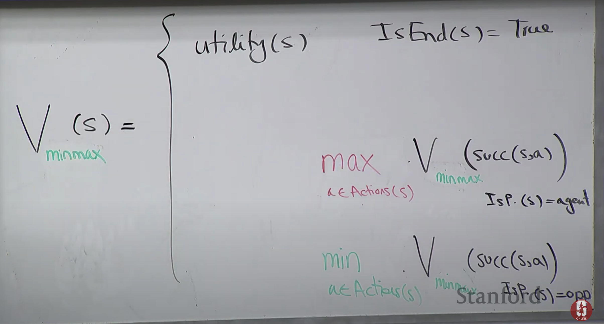

# Intro

So the question is which bucket to choose

So this lecture we are talking about 
- full observasion (not like pocker where u cannot see their cards)
- Turn taking games (not like simotinouly)
- Zero sum game, if ur winning `$10` then ur opponent is losing `$10`, the total utility is 0 

# Games Expectimax

The utility only comes at the end state
(u only get the reward at the end of game)
  - the utility of the opponent will be 0 - `your utility` since it's a zero-sum game
  
The players is a function of state, basically it tells u about who's turn in it, who's in contorl now

## Policies

What is the solution or what are we trying to do in a game

Policy is a function of state, it returns the action u gonna take in that state.

But here we have players, the policy depends on the different player

## Game Evaluation
If someone comes and gives me a policy, how good is that one

Even though the utility is on leaf node, we can calculate all the way up to other nodes, and see the value of the policy

It gonna be 
- the utility if ur in the end state
- The expected sum of all possible actions of the player [schoastic prob*value of successor state]

Assuming that we know what policy the opponent **gonna** take, we can evaluate and then take the policy that maximize the value (Expectimax)=> Value iteration

Problem:
We don't know opponent's policy
=>
Approach: Assume the worst case (Will this always be the best approach?)

That's when `minimax` comes to play

# Minimax

As the agent, we are still trying to maximize the expected value

For the opponent, we would assume it's gonna take the action that minimize the expected value (assume the worst case)

## Properties

The things that an agent can do:

- Pimax: I am going to maximize, assuming the opponent going to minimize
- Piexpectimax(7): I am going to maxinize, assuming the oppenent gonna follow policy 7

The things that the oppenent can do:

- Pimin: I am gonna minimize
- Pi7: (eg: acting schoastically 0.5 )

### Property 1
IF the opponent is trying his best to destroy me(minimizer), best thing I can do is to be a maximizer

It's going to be an upper bound over any other actions that the agent could take, under the assumpsion that the opponent is playing minimize(the opponent is trying his best to get me)

We are assuming the opponent is taking Pi 7 but they are actually a minimizer,
then this value is gonna be <= V(PImax, PImin)

### Property 2
It gonna be a lower bound if the opponent is not that bad

It is a lower bound that we are assuming the opponent is minimizing, but he is actually following PI 7

### Property 3
If u know sth about ur opponent, then u shouldn't do the minimax policy, because iu should do the thing based on ur knowledge of what opponent will do. Minimax is just preparing for the worst

## Expectiminimax

So the nature comes in, but we can view it as a new player

Same sort of recurrence, we will compute the expected value

## Complexity

Pretty bad though - exponential time

- Evaluation function
  - Define features and approximate
- Alpha-beta pruining
  - You don't have to explore the whole tree

# Evaluation function

We can explore the limited depth of the tree, however we don't know the value of future succesor states, how can we get the value?
- Use Evaluation function, it can be a weak estimate of future cost

## How to define Evaluation func
U can use some features and assign some weights

# Alpha-beta pruning
