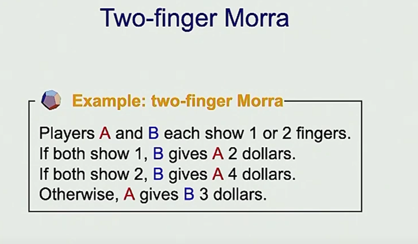
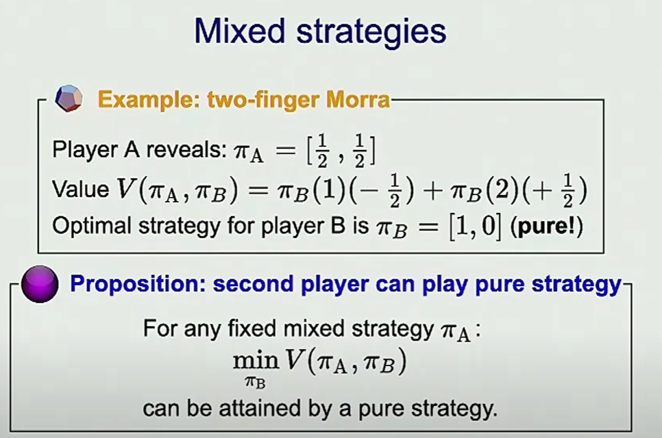
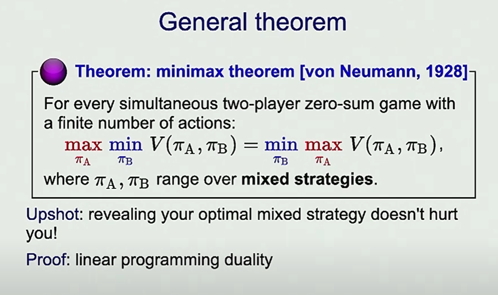
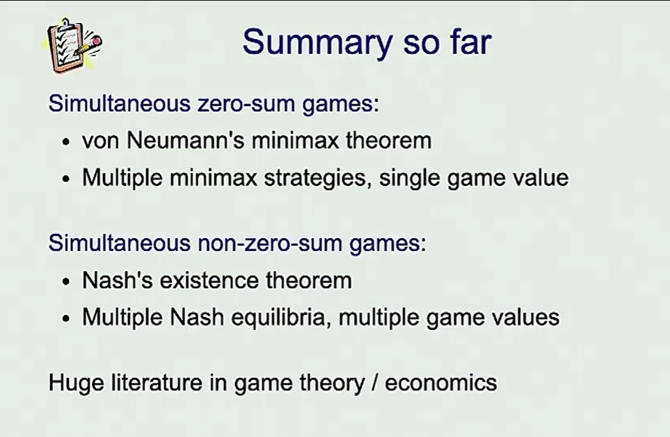

# 9. Game Playing 2 -TD Learning, Game Theory

## Introduction


We wanna learn the evaluation function
eg (what the weights should be)
Eval(s) function of s, parameterized by w
Ideally we wanna learn w from some data


# Temporal Difference Learning


Someone handcraft the features and we wanna learn the weights (in the simplest form)


Do feature engineering, come out a feature template


This generate different episodes that we can learn form

The reward throughout the episode is gonna be 0, until we reach the end of the game, and we might get some reward or not.


We can try to learning things from each small piece of expirences


V(s,w): function of state and weights, based on the V function we already have
Pred(w): Prediction function, a function depends on weights, 
Target: The target acts kind of like the label (y value), it equals to the reward get get from this action, and discount factor (usually 1 in games) * target(futureState,w). So if we do regression here, this is kind of the ground truth that we are trying to get to. So we can treat the target as like a value

- What are we trying to do in the regression?
- Minimize the loss

Loss(w) = `1/2(Pred(w) - Target)^2`
And we can use gradient descent


We can initiate the weights to be 0. For the first few examples, since we haven't reach the end state, we get no rewards, prediction - target is no difference, so we are not updating w

For S8 -> S9
We get the reward, we need to update w and try to match it

For S1 -> S2 (second row)
We found we actually overshoot, and we need to update the w, and so on.


## Comparison with Q-learning

They are similar
we are both looking at the difference between prediction and target

Q learning operates on Q function, which is a funciton of states, actions and weights
TD learning operates on Value funciton, which is a funciton of states and weights
This is because in context of games, we aready know about the rules so we kind of already know the actions

## Examples


## Summary So far

The idea of TD learning is to look at the error between prediction and target, and try to minimize that error, and find better W as we go through

# Simultaneous games


It seems that Minimax works pretty well for turn taking games, but how can we solve simultaneous games?


This is also a one-step game, you play and you will see what u get
This is a zero-sum game
## Payoff matrix
This is the utility of A

We are trying to look from one player's perspective

## Policy


## Game Evaluation


## How to optimize?
So what are we trying to do from this?
As from agent A's perspective, we are trying to maximize the value

But the challenge is, we are playing simultaneously, and minimax may not apply

So let's make it turn taking


What we just learnt:
If we have pure strategies, going 2nd is better

### What if A reveal his policy?


As B, we wanna minimize, and Pi() function is a probability,
so we wanna always choose 1 and do not choose 2 



What we just learnt:
If player A plays mixed strategy, player has optimal pure strategy


In a more general case

Player A reveal his/her startegy
It has prob p to choose action 1 and prob (1-p) to choose action 2
And player B has to follow a pure strategy as we concluded

Player A gonna take a `p` that has max value of`Max(5p - 3, -7p + 4)`
So player B gonna take `Min(5p - 3, -7p + 4)`


They are two linear lines with different slope

Whatever p `A` is gonna decide, ends up in two different results and based on them, B is trying to minimize that. When B is trying to minimize, B is minimizing between these two linear functions `5p - 3` and `-7p + 4`.
These two linear function meets at one point and **that is the point that this thing is going to be minimized**, and that also corresponds to a `p` value where A tries to maximize this.

Though in this case A is still losing

What if B plays first? (B reveal his strategy)

And this gives the same result.

What this tells is that:
If u plays mixed strategy, even if u reveal ur best strategy at the beginning, it doesn't matter who goes first
If play mixed strategy, order of play doesn't matter



```
What we learnt:
- If we have pure strategies, going 2nd is better
- If one player plays mixed strategy, another player has optimal pure strategy
- If play mixed strategy, the order of play doesn't matter

```


# Non-zero-sum ganes


In real life you are kind of somewhere in between that
Example:


For player A: 
When at Nash Equilibrium (Pi*A and Pi*b), the value is gonna be greater than all other policies u can choose if u have a fixed PiB

For player B(The same thing): 
When at Nash Equilibrium (Pi*A and Pi*b), the value is gonna be greater than all other policies u can choose if u have a fixed PiA


Let's say we start from `A = 0, B = -10`
For A is pretty good, but B has an incentive to change that
So B has an incentive to move to Direction `A = -5, B = -5`

What if we start from `A = -1, B = -1`
A has an incentive to change to Direction `A = 0`, during which `B = -10`

So we have a Nash Equilibrium at `A = -5, B = -5`



# State-of-the-art


